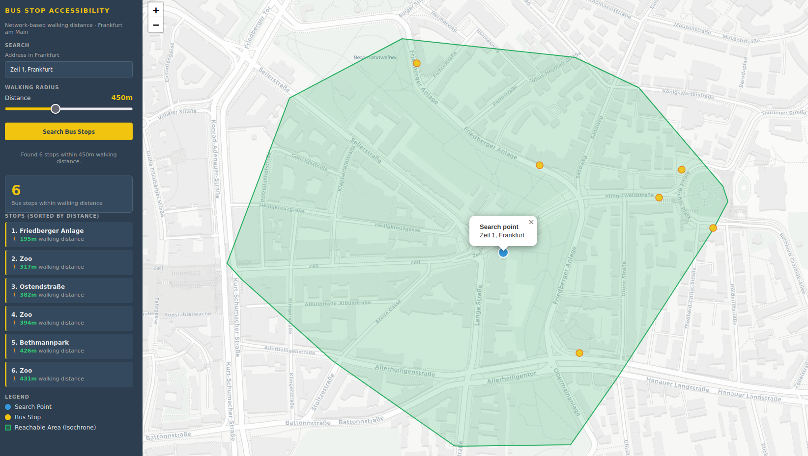

# Bus Stop Accessibility Analyzer

A full-stack geospatial web application that analyzes public bus stop accessibility in Frankfurt am Main using **network-based walking distance** — not simple radius buffers. Built with real OpenStreetMap data, PostGIS spatial queries, FastAPI and an interactive Leaflet map.



---

## Motivation

Urban mobility planning depends on understanding how well neighborhoods are served by public transport. Simple radius buffers ignore streets, buildings and real walking paths. This tool uses the **actual pedestrian street network** to calculate reachable bus stops — directly applicable to smart city, urban planning, and mobility GIS workflows.

---

## Features

- Address geocoding → coordinates via osmnx
- **Network-based walking distance** using real pedestrian street network (not simple buffers)
- **Isochrone generation** — polygon showing the actual reachable area on foot
- Bus stops sorted by real walking distance in sidebar
- Click on stop in sidebar → map flies to location
- REST API serving GeoJSON endpoints with FastAPI
- Fully containerized PostGIS database via Docker
- Cloud deployment: Render (API) + Supabase (PostGIS)
- Reproducible environment via conda

---

## Network-based vs. Simple Buffer

| | Simple Buffer | Network-based (this project) |
|---|---|---|
| Method | Circle around stop | Actual street graph |
| Accuracy | Low | High |
| Considers streets | ❌ | ✅ |
| Considers obstacles | ❌ | ✅ |
| Industry standard | No | Yes |

---

## Tech Stack

| Layer | Tool |
|---|---|
| Database | PostgreSQL + PostGIS (Docker / Supabase) |
| ETL | osmnx · GeoPandas · Python |
| Network Analysis | osmnx · NetworkX |
| API | FastAPI · SQLAlchemy |
| Frontend | Leaflet.js · HTML/CSS |
| Deployment | Render (API) · Supabase (DB) |
| Environment | conda · Docker Compose |

---

## Architecture

```
OpenStreetMap (OSM)
        ↓
ETL Pipeline (osmnx + GeoPandas)
        ↓
PostGIS Database (Supabase)
        ↓
FastAPI REST API (Render)
        ↓
Leaflet Frontend (Browser)
```

---

## How It Works

1. User enters an address and walking radius (e.g. 300m)
2. Address is geocoded to coordinates via osmnx
3. Pedestrian street network is loaded around the point
4. NetworkX calculates all nodes reachable within the radius
5. Bus stops within the reachable area are fetched from PostGIS
6. Each stop's actual walking distance is computed via shortest path
7. Isochrone polygon is generated from reachable network nodes
8. Results displayed on map + sorted list in sidebar

---

## API Endpoints

| Endpoint | Description |
|---|---|
| `GET /api/search?address=Zeil+1+Frankfurt&radius=300` | Network-based stop search |
| `GET /api/stops` | All bus stops as GeoJSON |
| `GET /api/stops?district=Bockenheim` | Filtered by district |
| `GET /api/coverage?radius=300` | Union of all stop buffers |
| `GET /api/gaps?radius=300` | Areas without bus coverage |
| `GET /api/stats` | Stop count per district |

Interactive API docs: `https://bus-stop-accessibility.onrender.com/docs`

---

## Installation

### Requirements

- Docker
- conda

### Setup

```bash
git clone https://github.com/tullah-gis/bus-stop-accessibility.git
cd bus-stop-accessibility

# Start PostGIS
docker compose up -d

# Create environment
conda env create -f environment.yml
conda activate bus-accessibility

# Load OSM data into PostGIS
python -m backend.etl.load_data

# Start API
uvicorn backend.main:app --reload
```

Open `frontend/index.html` in your browser.

API docs: `http://localhost:8000/docs`

---

## Project Structure

```
bus-stop-accessibility/
├── docker-compose.yml
├── requirements.txt
├── environment.yml
├── Dockerfile
├── backend/
│   ├── main.py             # FastAPI app
│   ├── database.py         # DB connection
│   ├── models.py           # Table definitions
│   ├── routes/
│   │   ├── stops.py        # Coverage & gap endpoints
│   │   └── search.py       # Network-based search endpoint
│   └── etl/
│       └── load_data.py    # OSM → PostGIS pipeline
├── frontend/
│   └── index.html          # Leaflet map
└── img/
    └── bus-access.png
```

---

## Author

**Tahira Ullah** — Geoinformatikerin
MSc Geography (Geoinformatics), Ruprecht-Karls-Universität Heidelberg
📧 tahira.ullah@hotmail.de
🌍 Frankfurt am Main, Germany

---

## License

MIT License — free to use, modify, and distribute with attribution.

*Data © OpenStreetMap contributors — [openstreetmap.org/copyright](https://www.openstreetmap.org/copyright)*
